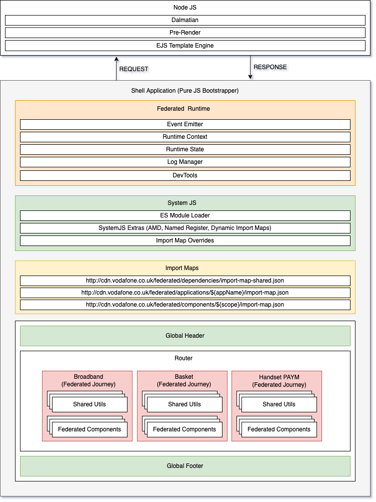

# Shell Architecture

A shell is a web application that is responsible for orchestrating and rendering of one or more [Federated Application's](/sections/architecture/federated-architecture?id=federated-frontend-applications-ffa) or [Federated Journey's](/sections/architecture/federated-architecture?id=federated-journeys-fj). It is responsible for fetching the components that make up the application and rendering them. It is also responsible for fetching the stylesheets and scripts that are needed to render the components. The Shell also imports the [Federated Runtime Engine](/sections/architecture/federated-architecture?id=federated-runtime-engine-fre) and the [Federated Application](/sections/architecture/federated-architecture?id=federated-frontend-applications-ffa) to render the application.

The shell is also responsible for mounting the components and unmounting them when the application is unloaded and takes care of the [Federated Lifecycle Events](/sections/packages/federated-core?id=federated-lifecycle-events).

A [Federated Application Routing Engine](/sections/architecture/federated-architecture?id=federated-application-routing-engine-fare) is used to determine which component to render and which component to unmount based on the current URL.

The [Federated Runtime Engine](/sections/architecture/federated-architecture?id=federated-runtime-engine-fre) also handles the client-side routing between different [Federated Applications](/sections/architecture/federated-architecture?id=federated-frontend-applications-ffa) to avoid having to down an HTTP round-trip to change routes.

Below is a diagram of the shell architecture.

## Core Concepts

### First Route as Host Concept (FRAH)
The First Route As Host concept is used to describe how an application is mounted client side. The concept is that the first route a user hits when they visit the application is the host route. All other routes are then mounted as children of the host route and are routed between by the [Federated Application Routing Engine](/sections/architecture/federated-architecture?id=federated-application-routing-engine-fare).

This allows for building a single page application that is composed of multiple routes that can be independently mounted and unmounted at runtime from remote sources.

This gives the application a more moduler feel and gives the end-user the feeling of a single page application but allows for the application to be built on top of different frameworks and by different teams and to be deployed independently of each other.

By utilising the First Route As Host concept, multiple development teams can work on the same application and be able to share code and assets between them whilst still giving delivery teams autonomy over the way they build their applications and how they deploy them.

### Client-Side Rendering (CSR)

Client-Side Rendering (CSR) is a technique for rendering a web application client-side without the need for a round-trip to the server.

Client-Side Routing is not a new concept, and frontend frameworks like React and Vue have already support it using the Router component.

However, when you are building a [Federated Application](/sections/architecture/federated-architecture?id=federated-frontend-applications-ffa), the way your render the application is very different.

Instead of using something like React Router the [Federated Runtime Engine](/sections/architecture/federated-architecture?id=federated-runtime-engine-fre) will be responsible for rendering the application client-side using its own [Federated Routing Engine](/sections/architecture/federated-architecture?id=federated-application-routing-engine-fare).
