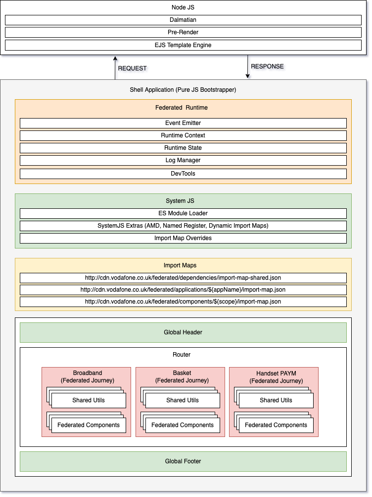

# Shell Architecture

A shell is a web application that is responsible for rendering the content of a [Federated Application](/sections/architecture/federated-applications/index.md)). It is responsible for fetching the components that make up the application and rendering them. It is also responsible for fetching the stylesheets and scripts that are needed to render the components. The Shell also imports the [Federated Runtime Engine]() and the [Federated Application]() to render the application.

The shell is also responsible for mounting the components and unmounting them when the application is unloaded and takes care of the [Application Lifecycle Events]().

A [Federated Application Routing Engine](/sections/architecture/federated-applications/federated-routing-engine.md) is used to determine which component to render and which component to unmount based on the current URL.

The [Federated Runtime Engine](/sections/architecture/federated-applications/federated-runtime-engine.md) also handles the client-side routing between different [Federated Applications](/sections/architecture/federated-applications/index.md)) to avoid having to down an HTTP round-trip to change routes.

Below is a diagram of the shell architecture.

